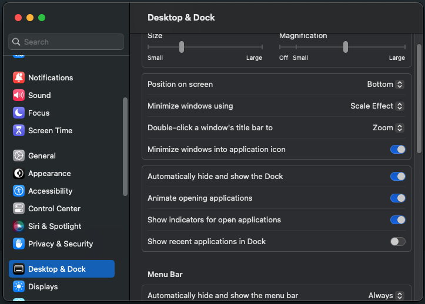

# Mac Settings

## 목차


## 1. 개요

사용하던 Mac OS 기기를 변경할 경우, Apple 계정과 iCloud를 통해 왠만한 설정들은 옮겨갈 수 있지만 저와 같은 개발자는 업무를 위해 새로운 계정을 생성하거나 iCloud로 옮기기 어려운 설정이나 프로그램들이 존재할 수 있다.
위와 같은 이유로 주로 사용하는 필수적인 Mac 설정이나 프로그램들을 정리하고자 하였다.


## 2. Mac OS 설정
> 별도의 프로그램 없이 설정 가능한 OS 설정, 해당 설정은 거의 모든 설정을 icloud를 통해 옮길 수 있을 것 으로 보인다.

 
1. 시스템 설정 접근하기


- 애플로고 클릭 > System Settings 클릭

2. Desktop & Dock tab

- Dock
    - Dock Size 및 Magnification은 취향에 맞게 조절
        - 화면 크기에 따라 설정이 다름

    - Minimize windows using: Scale Effect
    - Minimize windows into application icon: True
    - Automactically hide and show the Dock: True
    - Animate opening applications: True
    - Show recent application in Dock: False

- Menu Bar
    - Automatically hide and show the menu bar: Always
    - Recent documents, applications, and servers: 10

- Windows & Apps
    - Prefer tabs when opening documents: In Full Screen
    - Ask to keep changes when closing documents: False
    - Close windows when quiting an application: True
    - Stage Manager: False
    - Default web browser: Google Chrome
- Mission Control
    - Automatically rearrange Spaces based on most recent use: False
    - When switching to an application, switch to a Space with open windows for the application: True
    - Group windows by application: True
    - Display have separate Spaces: True
- Hot Conners
    - top-left: -
    - top-right: Notification Center
    - bottom-left: Launchpad
    - bottom-right: Quick Noe

3. Battery
- Wake for network access: Only on Power Adapter

- Optimize video streaming while on battery

4. Lock Screen
- Start Screen Saver When inactive" Never
- Turn display off on battery when inactive: For 10 minutes
- Turn dispay off on Power adapter when inactive: Never
- Require password after screen saver begins or display it turned off: After 5 minutes
- Show message when locked: False

5. Accessibility
- Trackpad Options > Dragging style: Three Finger Drag


## 3. Home Brew

1. Install: https://brew.sh/index_ko

### Packages

- nvm
- openjdk
- autojump
- pyenv
- pyenv-virtualenv
- python@{version}
- go
- zsh
    - zsh-autosuggestions
    - zsh-syntax-highlighting

Casks
- maccy
- slack
- vscode
- iterms2

## 4. iTerms2

```bash
brew install --cask iterms2 

cd ~

# install oh-my-zsh
sh -c “$(curl -fsSL https://raw.githubusercontent.com/robbyrussell/oh-my-zsh/master/tools/install.sh)”

# install oceanic material
https://iterm2colorschemes.com/

curl -O https://raw.githubusercontent.com/mbadolato/iTerm2-Color-Schemes/master/schemes/MaterialOcean.itermcolors

vim .zshrc

ZSH_THEME="agnoster"

# plugins
# autojump: brew install autojump
# zsh-autosuggestions: brew install zsh-autosuggestions
# zsh-syntax-highlighting: brew install zsh-syntax-highlighting

plugins=(
  autojump
  zsh-autosuggestions
  zsh-syntax-highlighting
)

[ -f /opt/homebrew/etc/profile.d/autojump.sh ] && . /opt/homebrew/etc/profile.d/autojump.sh

source /opt/homebrew/share/zsh-syntax-highlighting/zsh-syntax-highlighting.zsh
source /opt/homebrew/share/zsh-autosuggestions/zsh-autosuggestions.zsh

export EDITOR=/usr/bin/vim


# install D2coding font
https://github.com/naver/d2codingfont

# setting new line 
~/.oh-my-zsh/themes/agnoster.zsh-theme

PROMPT='%{%f%b%k%}$(build_prompt) '

# modify function
prompt_context() { 
    if [[ "$USER" != "$DEFAULT_USER" || -n "$SSH_CLIENT" ]]; then 
        prompt_segment black default "%(!.%.)$USER" 
    fi 
}

# add function
prompt_newline() {
  if [[ -n $CURRENT_BG ]]; then
    echo -n "%{%k%F{$CURRENT_BG}%}$SEGMENT_SEPARATOR
%{%k%F{blue}%}$SEGMENT_SEPARATOR"
  else
    echo -n "%"
  fi

  echo -n "%"
  CURRENT_BG=''
}

```


## 5. Alfred 4

spolight 대체 애플리케이션

```zsh
brew install --cask alfred
```

## 6. Docker Desktop

docker desktop

```zsh
brew install --cask docker
```

## 7. Docker compose 

docker compose

```zsh
brew install docker-compose
```

## 8. run cat

### show system information
The cat tells you the CPU usage of Mac by running speed.

https://apps.apple.com/us/app/runcat/id1429033973?mt=12


## 9. Jetbrains toolbox

IDE

https://www.jetbrains.com/toolbox-app/


## 10. Unicorn https

Bypassing SNI HTTPS Filtering

https://apps.apple.com/kr/app/unicorn-https/id1475628500?mt=12

## 11. Amphetamine

잠자기 방지

https://apps.apple.com/kr/app/amphetamine/id937984704?mt=12

## 12. AlDente

배터리 충전 관리

https://github.com/davidwernhart/AlDente-Charge-Limiter

## 13. Maccy

클립보드 관리

https://github.com/p0deje/Maccy

## 14. keka

압축 프로그램

https://www.keka.io/en/

## 15. AppCleaner

앱 삭제 프로그램

https://freemacsoft.net/appcleaner/

## 16. MS Office

App store